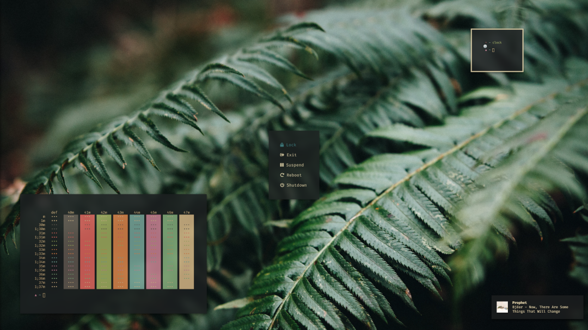

# Dotfiles

[](https://github.com/brettinternet/dotfiles/actions/workflows/lint.yml)



Basic dotfiles setup with [dotbot](https://github.com/anishathalye/dotbot/tree/master) for consoles, [codespaces](https://docs.github.com/en/github/developing-online-with-codespaces/personalizing-codespaces-for-your-account) and Xorg. For advanced system setup, see my [linux](https://github.com/brettinternet/linux) and [homelab](https://github.com/brettinternet/homelab) playbooks.

```sh
./install
```

### Set up a workstation

```sh
make {desktop|laptop|server|vmguest|vmguest-arch|mac}
```
