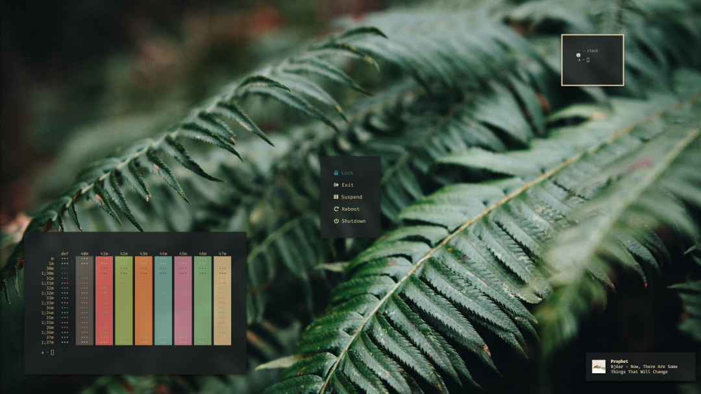

# Dotfiles



Basic dotfiles setup with [dotbot](https://github.com/anishathalye/dotbot/tree/master) for consoles, nix-darwin, linux servers and Xorg. For advanced system setup, see my [homelab](https://github.com/brettinternet/homelab) playbooks.

```sh
./install
```

## Set up a workstation

```
make {darwin|server|thinkpad}
```

### Machine-local Git configuration (macOS)

The managed `~/.gitconfig` includes `~/.gitconfig.local` last. Put machine-local
settings there to override managed defaults without editing tracked dotfiles.
The local file is not installed or tracked; it is harmless if missing.

To authenticate GitHub CLI, run `gh auth login`, choose HTTPS, and answer **No**
when asked whether to authenticate Git with your GitHub credentials. After CLI
login, configure its Git credential helper separately:

```sh
GIT_CONFIG_GLOBAL="$HOME/.gitconfig.local" gh auth setup-git --hostname github.com
```

This writes the helper configuration to the local file rather than the managed
`~/.gitconfig`. Use the same override when rerunning `gh auth setup-git`.
