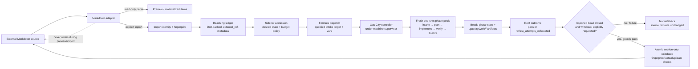

# Gas City architecture

This document describes the installed Gas City 1.3.5 city and its sidecar. It is
an architecture and boundary document, not a second workflow specification.
The tracked city configuration is portable; runtime state, the Beads database,
and machine-specific overlays remain ignored.

## System boundaries and sources of truth

The system has four deliberately separate responsibilities:

- **External Markdown is the source document.** Preview and import read it. Neither
  operation rewrites the source. A separate, explicit writeback operation is the
  only path that can replace a source section.
- **Beads is the rig ledger.** The installed Beads 1.1.0 ledger is Dolt-backed,
  not SQLite. It records imported items, stable external references, dependencies,
  workflow root and phase beads, metadata, assignment, and lifecycle state. Gas
  City and Beads remain workflow truth; the sidecar does not maintain a competing
  task ledger.
- **Gas City is the runtime workflow truth.** Its controller schedules and claims
  beads, runs formula-v2 graphs, emits replayable sequence-cursored events in
  `.gc/events.jsonl`, and exposes the runtime API and dashboard. It owns phase
  lifecycle and workflow completion.
- **The sidecar is policy and admission.** It owns desired state, provider-aware
  admission, budget modes, notifications (including optional Pushover), and the
  backlog adapter. It dispatches eligible backlog work to Gas City but is not a
  second orchestrator.

A workflow may persist small structured results in bead metadata (`gc.output_json`)
and larger state as files. The source document is not an artifact store and is not
updated as phases run. Formula steps do not merge or push source changes.

## Supervisor, city, pack, and rig

`gc init` registers the city with the machine-wide launchd supervisor
`com.gascity.supervisor`. The supervisor is the process boundary for the Gas City
controller; it is not the sidecar and it is not a phase worker. Starting or
stopping the supervisor changes controller availability, while workflow state in
Beads and artifacts in the rig working tree remain durable.

The tracked `city.toml` is the portable city definition. It includes the ignored
`city.local.toml` and sidecar-owned `city.sidecar.toml` overlays, declares `omp`
as the workspace provider, and sets the conservative default
`workspace.max_active_sessions = 2`. Direct provider aliases are declared for
`claude`, `codex`, `omp`, and `pi`. The `fixture` rig has prefix `fx`, default
branch `main`, starts suspended, and imports the city root (`source = "."`). The
city also patches the `control-dispatcher` and `intake` agents with one minimum
active session each.

`pack.toml` makes the city itself the root schema-2 pack. Its `bd` and `core`
imports are pinned to the recorded Gas City revision. Machine-local `.gc/`,
`.beads/`, `.local/`, overlays, and environment files are not portable pack
content and are not tracked.

A rig is the execution and ledger boundary: its Beads store, Gas City bindings,
phase targets, and `.gascity/work/` artifacts belong together. A workflow root
bead is the durable join point for the phase beads and outcome. Every phase and
attempt is filtered/routed against that root, so an unrelated root cannot satisfy
or advance the current workflow.

## Backlog adapter and idempotent import

There is one Markdown adapter in
`sidecar/src/gascity_sidecar/backlog/`. It is standalone-testable without the
HTTP API. Pack command wrappers invoke it through `uv run`; the pack does not
invent a top-level machine-readable `adapters/` directory. Linear and Jira are
interfaces and fixture payloads, not additional runtime adapters.

Preview parses and reports actionable items without a ledger write. Import
uses the item’s stable external reference and deterministic identity/fingerprint.
It looks up an exact external reference, then creates or updates the Beads item
with metadata and dependency edges. On installed Beads 1.1.0, the supported
lookup is a JSON search using `--external-contains` with all statuses; returned
records are exact-matched, ambiguous matches are refused, and the full result set
is considered so an item beyond the default page cannot cause a duplicate. A
re-import therefore returns the existing bead (or reconciles its same-source
metadata/dependencies) rather than creating a second bead.

Import is source-read-only. It never rewrites the Markdown file, even when a
source item is already present in Beads. Writeback is intentionally not part of
preview, import, dispatch, or phase execution.

## Fresh one-shot phase pools

Fresh context is a hard project requirement implemented through configuration,
not an assumption about a generic Gas City session. Each phase has one pool
agent configured with:

```toml
wake_mode = "fresh"
lifecycle = "one_shot"
min_active_sessions = 0
```

The five phase targets are `fixture/gc.intake`, `fixture/gc.planner`,
`fixture/gc.implementer`, `fixture/gc.verifier`, and `fixture/gc.reviewer`.
Each formula step routes to its phase target. Consequently, each phase claim is
made by a fresh provider session, and each repair iteration gets a fresh
implementer session rather than reusing the previous attempt’s context. A pool
session claiming two phase beads is an isolation defect, not an optimization.

The current demo prepares a durable nonterminal session record for each exact
phase template for the happy and halt paths. The repair path prepares the four
non-iterating phase pools but leaves implementer demand unbound: the controller
spawns a new one-shot implementer for each check iteration, and polling adopts
that attempt’s assigned session ID. These durable records do not imply five
simultaneous workers; the workspace cap still bounds active runtime sessions.
The normal dispatch target is the qualified `fixture/gc.intake`, never the bare
rig name. Session discovery, wake/reload reconciliation, same-template race
replacement, and post-closure session disappearance are bounded orchestration
around the controller; they do not manually assign or close phase beads.

Review context is deliberately narrow. A reviewer receives the plan, acceptance
criteria, current diff, and latest implementer report. It does not receive prior
provider transcripts. The different-provider review call is a one-shot invoked by
the implementer check script, not an additional Gas City session bead.

## Formula-v2 workflow and repair loop

The workflow is a formula-v2 graph with an explicit dependency chain:

```text
intake -> plan -> implement -> verify -> finalize
```

Each edge is a `needs` relationship, and each step has a `gc.run_target` for its
phase pool. Dispatch materializes a root bead and passes `item` plus a bounded
`max_repair_attempts` formula variable. The default backlog-item formula permits
two attempts.

The implement step’s `[steps.check]` is the repair loop. Gas City compiles that
check into its `ralph` control bead. The check script invokes a one-shot reviewer
from a different provider (for example, `claude -p` or an OMP Claude profile),
validates the structured verdict, persists findings, and returns an exit status.
A passing status releases the graph to verification. A failing status causes
bounded re-iteration until the literal attempt budget is exhausted. Iterations
are retained as `<step>.iteration.N` beads with matching per-attempt artifact
directories; they are not hidden retries.

Installed-version constraints shape the formulas:

- Gas City 1.3.5 rejects a substituted `{{max_repair_attempts}}` in an integer
  `steps.check.max_attempts` field. The repository therefore keeps the default
  two-attempt `backlog-item` formula and literal-budget variants
  `backlog-item-repair-1`, `backlog-item-repair-2`, and `backlog-item-repair-3`.
  The one-attempt variant is the deterministic exhaustion path.
- The checker persists the bounded reviewer input (`reviewer-input.md`),
  `review.md`, and `verdict.json`. It resolves the workflow root from the
  assigned run, fails closed on ambiguous plans, and reviews the current diff
  including staged changes.
- `loop.until` is documented inert and `gc converge` is v1-only; neither is part
  of this v2 design. Unknown formula keys are not relied upon.
- The review check runs inside the implementer’s check, so the reviewer is not a
  separately claimable Gas City session. This is an accepted boundary of the
  installed implementation.

On genuine exhaustion, the always-schedulable finalizer records
`gc.outcome = "fail"`, `gc.failure_class = "review_attempts_exhausted"`, and the
number of exhausted attempts. Verification is not produced. The durable result
contains `brief.md`, `plan.md`, a failed `final.md`, and exactly one report,
review, and verdict for each materialized failed attempt; the source bead remains
open and no writeback occurs.

State is passed between phases in two sizes:

- `gc.output_json` in bead metadata carries small structured results. Installed
  Gas City 1.3.5 emits a deprecation warning recommending `drain`, but this
  project explicitly keeps `gc.output_json` as its required contract.
- The rig working tree carries durable files under
  `.gascity/work/<workflow-root-bead>/`:

  ```text
  brief.md
  plan.md
  attempts/N/reviewer-input.md
  attempts/N/report.md
  attempts/N/review.md
  attempts/N/verdict.json
  verify.md
  final.md
  ```

  A successful run retains every attempt’s report, review, and verdict along with
  all four phase reports. Stop/start and phase-session recovery must not lose
  these files.

## Sidecar policy and control boundary

The sidecar consumes Gas City status/events and dispatches backlog work after
applying admission policy. It stores desired state and notification/dedupe state,
selects budget mode, and provides the backlog adapter and operator controls. The
Gas City controller, not the sidecar, remains responsible for Beads claims,
formula scheduling, phase execution, event sequencing, and workflow closure.

Runtime concurrency changes use supported configuration plus `gc reload`; there
is no Gas City runtime verb that mutates a live concurrency limit. The tracked
city references ignored `city.sidecar.toml`; sidecar control mutations write that
file atomically and reload the city. Installed 1.3.5 accepts only
`[workspace].max_active_sessions` for the verified dynamic cap and rejects
`providers.*.max_active_sessions`. A change applies to future materialized work,
not already-running workflows. In conserve mode the sidecar uses workspace cap 1
and warns that this installed version cannot prove a provider-only cap, so
non-Codex sessions are constrained too; critical and paused modes remain
provider-aware admission decisions.

The operator status/control surface is loopback-only for mutations. Status may be
read separately, but LAN/authenticated mutation support is outside this boundary.
A typed durable stop is a control-plane action; it does not rewrite source or
pretend to be a workflow phase.

## End-to-end data flow



The writeback edge is intentionally outside the workflow graph. A successful
path closes the imported source bead before invoking guarded writeback. A halted
or failed path leaves the source bead open and the Markdown bytes unchanged.
Writeback refuses a changed fingerprint, missing or ambiguous source state, or
duplicate identity; a refusal is not converted into a retry or a source rewrite.

## Installed-version boundaries to preserve

These are implementation constraints, not optional improvements:

- The requested `workspace.timezone` is not in the installed 1.3.5 config schema;
  it is ignored with a warning. `America/Denver` may be documented as intent but
  must not be treated as runtime configuration.
- Included fragments are merged before root `city.toml` values. The tracked
  conservative cap therefore remains authoritative for the portable base; local
  overlays are for machine-specific additions and the sidecar’s supported
  runtime mechanism, not an assumption that every scalar overlay wins.
- Builtin `omp` and `pi` providers exist even though the `gc init --providers`
  allowlist does not accept those names. This city uses direct provider aliases
  and does not depend on the init allowlist.
- Native OMP transcripts are not resolved by `gc session logs` in 1.3.5. Runtime
  events and native provider evidence may exist, but architecture and portable
  docs must not require machine-local transcript paths or symlinks.
- The installed Beads CLI has no `bd list --external-ref` flag. Exact external
  reference matching uses the supported all-status search path described above;
  ambiguous results fail closed.
- Formula `steps.check.max_attempts` uses literal integer variants rather than a
  substituted integer variable. Repair budgets passed at dispatch affect newly
  materialized runs only.

## Decisions 1–10 and rationale

1. **Gas City over awslabs/cli-agent-orchestrator (CAO).** CAO lacks a task
   ledger, bounded retry primitive, safe resume semantics, and reliable status
   detection. Gas City supplies the Beads ledger, formula-v2 `check`/`retry`,
   replayable sequence-cursored events, localhost API with admission controls,
   and multi-rig support, so it covers the required runtime without a parallel
   orchestration system.

2. **One Markdown adapter, not two.** Keeping the adapter in the sidecar makes
   it independently testable and gives one implementation for parsing,
   identity, preview, and import. Pack commands can call it through `uv run`.
   The pack schema-2 layout must not gain a machine-readable top-level
   `adapters/` directory; Linear/Jira therefore remain documented interfaces and
   fixtures rather than duplicate adapters.

3. **Use Gas City pack conventions for layout.** `city.toml` and `pack.toml`
   are accompanied by the conventional `agents/`, `formulas/`, `orders/`,
   `commands/`, `doctor/`, `assets/`, and template fragments as needed, while
   `docs/`, `fixtures/`, and `sidecar/` remain non-machine directories. The
   dropped `assets/backlog-sources.toml` avoids a second source registry; the
   sidecar adapter interface owns per-invocation source configuration.

4. **Make fresh context per phase a hard configuration requirement.** Gas City
   does not promise fresh context merely because a phase is named separately.
   One pool per phase with `wake_mode = "fresh"`, `lifecycle = "one_shot"`, and
   `min_active_sessions = 0` makes provider-session isolation observable and
   ensures every repair attempt gets new context. Reusing a session across two
   phase beads would invalidate review and acceptance evidence.

5. **Use formula-v2 `[steps.check]` for repair.** The check script can run a
   different-provider one-shot reviewer, persist findings, and use its exit code
   to drive a bounded iteration budget while retaining every attempt. This is
   preferable to an unbounded external loop. The reviewer-inside-check trade-off
   is accepted because it fits the installed formula runtime; inert `loop.until`
   and v1-only `gc converge` are excluded.

6. **Pass state through Beads metadata and rig artifacts.** Small structured data
   belongs in `gc.output_json`; reviewable and restart-surviving material belongs
   under `.gascity/work/<root>/`. This gives each phase a durable contract without
   copying long transcripts into beads. Reviewers receive only the plan,
   acceptance criteria, current diff, and latest report, which keeps context
   bounded and prevents prior transcripts from contaminating a repair attempt.

7. **Keep the sidecar thin policy, not a second orchestrator.** Gas City already
   provides the ledger, event replay, REST API, dashboard, admission primitives,
   and reload behavior. Duplicating those in a local control service would create
   conflicting truth. The sidecar therefore owns only backlog dispatch/admission,
   desired state, budget policy, notifications, and the adapter.

8. **Apply runtime limits to future work through config and reload.** Installed
   Gas City has no supported runtime concurrency verb. Atomic config mutation
   followed by `gc reload` matches its actual semantics and lets the sidecar
   report `applies_to: "future"` honestly. The repair-attempt budget is a formula
   variable at dispatch, so changing it cannot rewrite a run already materialized.

9. **Make import idempotent by stable external reference.** Lookup before create or
   update prevents re-import from duplicating a task, while metadata and
   dependency reconciliation keep Beads aligned with the same source item. A
   stable-id JSONL upsert is the alternative when indexed lookup is unavailable.
   Import remains read-only with respect to the source file, so ledger
   synchronization cannot accidentally modify external Markdown.

10. **Do not use orders for parameterized formula dispatch.** Installed Gas City
    orders cannot pass formula variables, while backlog workflows require an item
    and repair-budget value. Parameterized work therefore uses formula dispatch
    with explicit variables through the qualified intake target; orders are
    reserved for future var-less patrols. This avoids silently dropping required
    workflow inputs.
